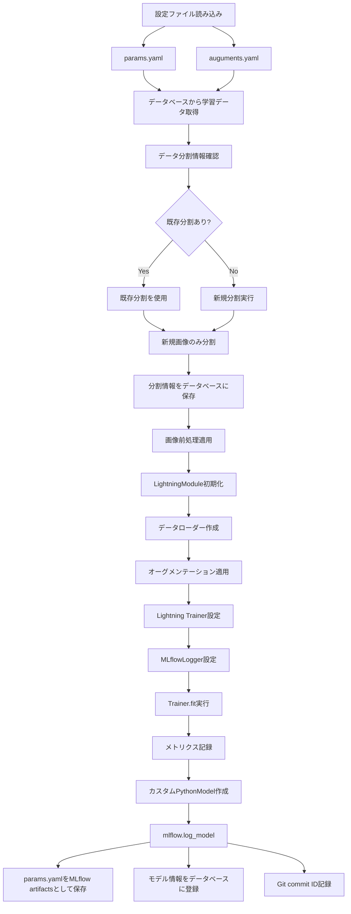
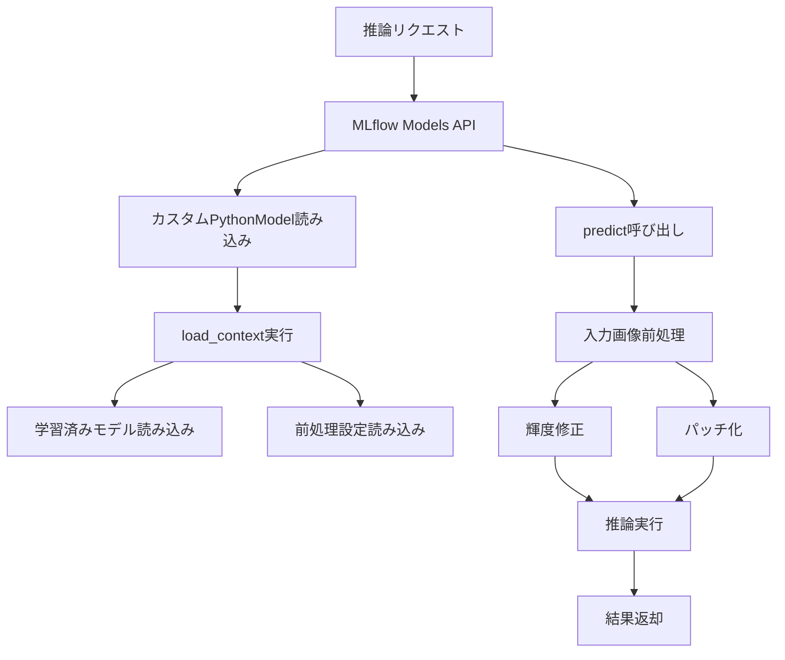
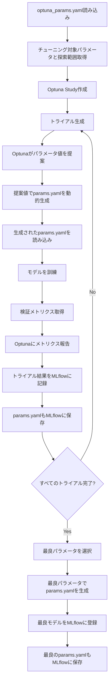

# アーキテクチャ設計書

## 1. システム全体アーキテクチャ

### 1.1 アーキテクチャ概要

本システムは、深層学習画像分類モデルの学習・推論を支援するMLOpsパイプラインです。以下の4つの主要レイヤーで構成されます：

1. **データレイヤー**: データの管理と前処理
2. **学習レイヤー**: モデルの学習とハイパーパラメータチューニング
3. **モデル管理レイヤー**: モデルの登録、バージョン管理、デプロイ
4. **推論レイヤー**: モデルの推論実行

### 1.2 システムアーキテクチャ図

```
┌─────────────────────────────────────────────────────────────────┐
│                        ユーザーインターフェース層                │
│  ┌──────────────┐  ┌──────────────┐  ┌──────────────┐        │
│  │ コマンドライン │  │  Webアプリ    │  │  MLflow UI   │        │
│  │   (CLI)      │  │  (将来実装)   │  │  (実験管理)   │        │
│  └──────┬───────┘  └──────┬───────┘  └──────┬───────┘        │
└─────────┼──────────────────┼──────────────────┼──────────────┘
          │                  │                  │
          ▼                  ▼                  ▼
┌─────────────────────────────────────────────────────────────────┐
│                        アプリケーション層                       │
│  ┌──────────────┐  ┌──────────────┐  ┌──────────────┐        │
│  │  学習モジュール │  │  チューニング  │  │  推論モジュール │        │
│  │  (Training)  │  │  (Optuna)    │  │  (Inference) │        │
│  └──────┬───────┘  └──────┬───────┘  └──────┬───────┘        │
└─────────┼──────────────────┼──────────────────┼──────────────┘
          │                  │                  │
          ▼                  ▼                  ▼
┌─────────────────────────────────────────────────────────────────┐
│                        コア処理層                                │
│  ┌──────────────┐  ┌──────────────┐  ┌──────────────┐        │
│  │ データ処理    │  │  モデル定義   │  │  前処理・     │        │
│  │  (Data)      │  │  (Models)    │  │  オーグメント  │        │
│  └──────┬───────┘  └──────┬───────┘  └──────┬───────┘        │
└─────────┼──────────────────┼──────────────────┼──────────────┘
          │                  │                  │
          ▼                  ▼                  ▼
┌─────────────────────────────────────────────────────────────────┐
│                        フレームワーク層                          │
│  ┌──────────────┐  ┌──────────────┐  ┌──────────────┐        │
│  │PyTorch       │  │  PyTorch     │  │  MLflow      │        │
│  │Lightning     │  │  Lightning   │  │  PythonModel │        │
│  └──────┬───────┘  └──────┬───────┘  └──────┬───────┘        │
└─────────┼──────────────────┼──────────────────┼──────────────┘
          │                  │                  │
          ▼                  ▼                  ▼
┌─────────────────────────────────────────────────────────────────┐
│                        バージョン管理層                          │
│  ┌──────────────┐  ┌──────────────┐  ┌──────────────┐        │
│  │     Git     │  │   Database   │  │    MLflow    │        │
│  │  (コード管理) │  │  (データ管理) │  │  (モデル管理) │        │
│  └─────────────┘  └──────────────┘  └──────────────┘        │
└─────────────────────────────────────────────────────────────────┘
```

## 2. レイヤー詳細設計

### 2.1 データレイヤー

#### 2.1.1 責務
- 学習データの作成と管理（テーマ、ラベル、画像データ）
- データベースからのデータ読み込みと検証
- データ分割の管理（既存分割の踏襲と新規分割）
- 画像前処理（輝度修正、パッチ化など）
- データオーグメンテーション（学習時のみ）
- Artifactsの管理

#### 2.1.2 主要コンポーネント

**データベース管理 (`src/database/`)**
- データベースモデル定義 (`models.py`)
- CRUD操作 (`crud.py`)
- データベース接続 (`connection.py`)
- テーマ、ラベル、学習データの管理
- データ分割情報の保存と取得

**データセット読み込み (`src/data/dataset.py`)**
- データベースから学習データを読み込み
- テーマを指定してデータを取得
- データ分割情報（train/valid/test）に基づいてデータを取得
- 画像ファイルはファイルパスから読み込む

**データ分割 (`src/data/split.py`)**
- train/valid/test分割の実行
- 初回学習時: 指定された分割比率で分割
- 再学習時: 既存画像はデータベースの分割情報を使用、新規画像のみ分割
- 分割情報をデータベースに保存

**前処理 (`src/data/preprocessing.py`)**
- 輝度修正（ヒストグラム均等化、ガンマ補正など）
- パッチ化処理
- 前処理済み画像の保存（オプション）

**オーグメンテーション (`src/data/augmentation.py`)**
- `auguments.yaml`からの設定読み込み
- 学習時のみ適用されるオーグメンテーション
- albumentations、torchvision.transformsの統合

### 2.2 学習レイヤー

#### 2.2.1 責務
- PyTorch Lightningを使用したモデル学習
- 学習プロセスの管理と制御
- メトリクスの記録
- モデルの保存とMLflowへの登録

#### 2.2.2 主要コンポーネント

**LightningModule (`src/training/lightning_module.py`)**
- PyTorch LightningのLightningModuleを継承
- モデルのforward、training_step、validation_step、test_stepを定義
- 損失関数とオプティマイザの設定

**Trainer設定 (`src/training/train.py`)**
- Lightning Trainerの初期化
- Callbacksの設定（EarlyStopping、ModelCheckpointなど）
- MLflowLoggerの設定
- 学習の実行
- `params.yaml`をMLflow artifactsとして保存

**Callbacks (`src/training/callbacks.py`)**
- カスタムCallbacksの定義
- 学習制御と最適化

**Optunaチューナー (`src/tuning/optuna_tuner.py`)**
- `optuna_params.yaml`からの設定読み込み
- Optuna Studyの作成と管理
- 各トライアルでの`params.yaml`動的生成
- トライアル結果のMLflow記録
- 最良パラメータの選択と`params.yaml`生成

### 2.3 モデル管理レイヤー

#### 2.3.1 責務
- モデルのMLflowへの登録
- バージョン管理（Git、データベース、MLflowの連携）
- カスタムPythonModelの実装
- 再現性の保証
- モデルと学習データの関連付け（データベース）

#### 2.3.2 主要コンポーネント

**MLflow PythonModel (`src/models/mlflow_model.py`)**
- `mlflow.pyfunc.PythonModel`を継承
- `load_context()`: 学習済みモデルと前処理設定の読み込み
- `predict()`: 前処理適用と推論の実行

**MLflow連携 (`src/utils/mlflow_utils.py`)**
- MLflowへのモデル登録
- メトリクスとパラメータの記録
- `params.yaml`をMLflow artifactsとして保存
- Git commit IDの記録

### 2.4 推論レイヤー

#### 2.4.1 責務
- MLflow Models API経由での推論実行
- 前処理の自動適用
- 推論結果の返却

#### 2.4.2 主要コンポーネント

**MLflow Models API**
- MLflow server経由での推論
- カスタムPythonModelの`predict()`メソッドが自動的に呼び出される
- 前処理が統合されているため、クライアント側での前処理は不要

## 3. データフロー設計

### 3.1 学習パイプライン



### 3.2 推論パイプライン



### 3.3 ハイパーパラメータチューニングパイプライン



## 4. バージョン管理アーキテクチャ

### 4.1 バージョン管理の連携

```
┌─────────────────────────────────────────────────────────────┐
│                    バージョン管理連携図                       │
└─────────────────────────────────────────────────────────────┘

学習実行時:
  Git (コード) ──┐
                ├──> MLflow Model Registry
  Database ─────┤     - Git commit ID
  (学習データ)   │     - params.yaml (artifacts)
                │     - Model artifacts
  params.yaml ──┤     - Hyperparameters
                │     - Metrics
  MLflow ───────┘     - Model-TrainData関連

再現時:
  MLflow Model ──> Git commit ID ──> コード復元
                ├─> Database ──> 学習データ復元
                └─> params.yaml ──> パラメータ復元
```

### 4.2 再現性の保証メカニズム

1. **学習時**:
   - Git commit IDを取得
   - データベースから学習データを取得（テーマ指定）
   - データ分割情報をデータベースから取得または新規作成
   - 使用した`params.yaml`をMLflow artifactsとして保存
   - モデル情報をデータベースに登録（Modelテーブル、ModelTrainDataテーブル）
   - MLflowにモデル登録時に以下を記録:
     - Git commit ID
     - `params.yaml`（artifactsとして）
     - MLflow run_id

2. **再現時**:
   - MLflowからGit commit IDを取得
   - 該当コミットにチェックアウト
   - データベースからModelTrainDataテーブルを使用して学習データを取得
   - MLflowから`params.yaml`を取得
   - データベースから分割情報を取得
   - 同じコード、データ、パラメータ、分割で再現可能

3. **Optunaチューニング時**:
   - 各トライアルで生成された`params.yaml`をMLflowに保存
   - 最良の`params.yaml`をMLflowに保存
   - 保存された`params.yaml`を使用して同じモデルを再現可能

## 5. コンポーネント間の依存関係

### 5.1 モジュール依存関係図

```
┌─────────────────┐
│   training/     │
│  - train.py    │──┐
│  - lightning_   │  │
│    module.py   │  │
└─────────────────┘  │
         │           │
         ▼           │
┌─────────────────┐  │
│    models/     │  │
│  - resnet.py   │  │
│  - model_      │  │
│    factory.py  │  │
│  - mlflow_     │◄─┘
│    model.py    │
└─────────────────┘
         │
         ▼
┌─────────────────┐
│     data/       │
│  - dataset.py   │
│  - split.py     │
│  - preprocessing│
│  - augmentation │
└─────────────────┘
         │
         ▼
┌─────────────────┐
│   database/     │
│  - models.py    │
│  - crud.py      │
│  - connection.py│
└─────────────────┘
         │
         ▼
┌─────────────────┐
│    tuning/      │
│  - optuna_      │
│    tuner.py     │
└─────────────────┘
         │
         ▼
┌─────────────────┐
│     utils/      │
│  - mlflow_utils │
└─────────────────┘
```

### 5.2 外部依存関係

- **PyTorch Lightning**: 学習フレームワーク
- **MLflow**: モデル管理と実験管理
- **データベース**: 学習データ管理（SQLite/PostgreSQLなど）
- **Optuna**: ハイパーパラメータチューニング
- **Git**: コードバージョン管理

## 6. データベース設計

### 6.1 データベーススキーマ

**Theme（テーマ）テーブル**
- `id`: 主キー（整数、自動増分）
- `name`: テーマ名（文字列、一意制約）
- `description`: テーマの説明（文字列、オプション）
- `created_at`: 作成日時（タイムスタンプ）
- `updated_at`: 更新日時（タイムスタンプ）

**Label（ラベル）テーブル**
- `id`: 主キー（整数、自動増分）
- `theme_id`: テーマID（外部キー、Theme.idを参照）
- `label_name`: ラベル名（文字列、テーマ内で一意）
- `created_at`: 作成日時（タイムスタンプ）

**TrainData（学習データ）テーブル**
- `id`: 主キー（整数、自動増分）
- `image_path`: 画像ファイルパス（文字列）
- `theme_id`: テーマID（外部キー、Theme.idを参照）
- `label_id`: ラベルID（外部キー、Label.idを参照）
- `split`: データ分割（文字列、'train'/'valid'/'test'）
- `labeled_by`: ラベル付けした人（文字列、オプション）
- `created_at`: 作成日時（タイムスタンプ）
- `updated_at`: 更新日時（タイムスタンプ）

**Model（モデル）テーブル**
- `id`: 主キー（整数、自動増分）
- `theme_id`: テーマID（外部キー、Theme.idを参照）
- `mlflow_run_id`: MLflowのrun_id（文字列、一意制約）
- `created_at`: 作成日時（タイムスタンプ）
- `updated_at`: 更新日時（タイムスタンプ）

**ModelTrainData（モデル-学習データ関連）テーブル**
- `model_id`: モデルID（外部キー、Model.idを参照）
- `train_data_id`: 学習データID（外部キー、TrainData.idを参照）
- 複合主キー: (model_id, train_data_id)

### 6.2 リレーション

- Theme 1対多 Label
- Theme 1対多 TrainData
- Theme 1対多 Model
- Label 1対多 TrainData
- Model 多対多 TrainData（ModelTrainData中間テーブル経由）

### 6.3 データベース機能要件

- テーマ、ラベル、学習データのCRUD操作
- 学習データの分割情報の保存と取得
- モデルと学習データの関連付け
- 再学習時の既存分割情報の取得と新規データの分割

## 7. 設定ファイル設計

### 7.1 params.yaml構造

```yaml
model:
  name: "ResNet18"
  num_classes: 10
  
training:
  batch_size: 32
  learning_rate: 0.001
  num_epochs: 100
  optimizer: "Adam"
  
data:
  split_ratio:
    train: 0.7
    valid: 0.15
    test: 0.15
  seed: 42
  
preprocessing:
  brightness_correction:
    enabled: true
    method: "histogram_equalization"
  patch:
    enabled: false
```

**注意**: `params.yaml`はOptunaチューニング時に動的に生成される場合があります。その場合、Optunaが提案したパラメータ値が反映されます。

### 7.1.1 optuna_params.yaml構造

```yaml
study:
  name: "classification_study"
  direction: "maximize"  # 最大化するメトリクス（例: validation_accuracy）
  n_trials: 50
  timeout: null  # 秒単位、nullの場合は無制限

params_to_tune:
  training.learning_rate:
    type: "float"
    low: 0.0001
    high: 0.01
    log: true  # 対数スケールで探索
    
  training.batch_size:
    type: "int"
    low: 16
    high: 128
    step: 16  # 16の倍数
    
  training.num_epochs:
    type: "int"
    low: 50
    high: 200
    step: 10
    
  model.name:
    type: "categorical"
    choices: ["ResNet18", "ResNet50", "ResNet101"]

base_params:  # チューニングしない固定パラメータ
  model:
    num_classes: 10
  data:
    split_ratio:
      train: 0.7
      valid: 0.15
      test: 0.15
    seed: 42
  preprocessing:
    brightness_correction:
      enabled: true
      method: "histogram_equalization"
    patch:
      enabled: false
```

### 7.2 auguments.yaml構造

```yaml
train:
  - type: "RandomRotation"
    degrees: 15
  - type: "RandomHorizontalFlip"
    p: 0.5
  - type: "ColorJitter"
    brightness: 0.2
    contrast: 0.2
  - type: "Resize"
    size: [224, 224]
  - type: "Normalize"
    mean: [0.485, 0.456, 0.406]
    std: [0.229, 0.224, 0.225]

valid:
  - type: "Resize"
    size: [224, 224]
  - type: "Normalize"
    mean: [0.485, 0.456, 0.406]
    std: [0.229, 0.224, 0.225]

test:
  - type: "Resize"
    size: [224, 224]
  - type: "Normalize"
    mean: [0.485, 0.456, 0.406]
    std: [0.229, 0.224, 0.225]
```

## 8. データストレージ設計

### 8.1 ディレクトリ構造

```
images/                  # 画像ファイル保存
├── [theme_id]/         # テーマごとのディレクトリ
│   ├── image1.jpg
│   ├── image2.jpg
│   └── ...

database.db             # データベースファイル（SQLiteの場合）

artifacts/              # 成果物
└── preprocessed/       # 前処理済み画像（オプション）
    └── ...

experiments/            # MLflow管理
└── mlruns/
    └── ...
```

### 8.2 データフロー

1. **画像ファイル**: `images/[theme_id]/` に保存
2. **メタデータ**: データベース（Theme、Label、TrainDataテーブル）で管理
3. **分割情報**: データベースのTrainDataテーブルの`split`カラムで管理
4. **前処理済み画像**: `artifacts/preprocessed/` に保存（オプション）
5. **モデル**: MLflow Model Registryに登録
6. **モデル-データ関連**: データベースのModelTrainDataテーブルで管理

## 9. エラーハンドリングとロギング

### 9.1 エラーハンドリング戦略

- **データ読み込みエラー**: データ形式の検証とエラーメッセージ
- **学習エラー**: PyTorch Lightningのエラーハンドリングを活用
- **MLflow接続エラー**: リトライロジックとフォールバック
- **データベースエラー**: データベース接続エラー、トランザクションエラーの処理

### 9.2 ロギング

- **学習ログ**: MLflowLoggerで自動記録
- **アプリケーションログ**: Python標準loggingモジュール
- **エラーログ**: 詳細なスタックトレースとコンテキスト情報

## 10. セキュリティ考慮事項

### 10.1 データセキュリティ

- データベースへのアクセス制御
- 機密データの暗号化（必要に応じて）

### 10.2 モデルセキュリティ

- MLflow Model Registryへのアクセス制御
- モデルの改ざん防止

## 11. パフォーマンス考慮事項

### 11.1 学習パフォーマンス

- PyTorch Lightningの分散学習サポート
- 混合精度学習（FP16）の活用
- データローダーの最適化（num_workers、pin_memory）

### 11.2 推論パフォーマンス

- MLflow Models APIのバッチ推論サポート
- モデルの最適化（TorchScript、ONNXなど、将来実装）

## 12. 拡張性設計

### 12.1 モデルアーキテクチャの追加

- モデルファクトリパターンを使用
- 新しいモデルは`src/models/`に追加し、`model_factory.py`に登録
- `params.yaml`からモデル名を指定して選択

### 12.2 前処理の追加

- 前処理は`src/data/preprocessing.py`に追加
- 設定ファイルから有効/無効を切り替え可能

### 12.3 Webアプリケーションの統合（将来）

- REST APIエンドポイントを追加
- 既存の学習・推論モジュールを再利用
- 非同期処理で学習ジョブを管理

## 13. デプロイメントアーキテクチャ

### 13.1 MLflow Server構成

```
┌─────────────────────┐
│   MLflow Server      │
│  - Model Registry    │
│  - Tracking Server   │
│  - Models API        │
└──────────┬──────────┘
           │
           ▼
┌─────────────────────┐
│   推論クライアント    │
│  - REST API呼び出し  │
│  - 前処理統合済み    │
└─────────────────────┘
```

### 13.2 学習環境

- ローカル環境またはクラウド環境（AWS、GCPなど）
- GPUリソースの利用（必要に応じて）
- データベースへの接続

## 14. 将来の拡張ポイント

### 14.1 データドリフト検知

- Alibi-detectの統合
- 推論データと学習データの比較
- アラート機能

### 14.2 Webアプリケーション

- Flask/FastAPIベースのREST API
- リアルタイム学習進捗表示（WebSocket）
- 学習履歴の可視化

### 14.3 モデル最適化

- TorchScriptへの変換
- ONNXへのエクスポート
- 量子化（Quantization）

